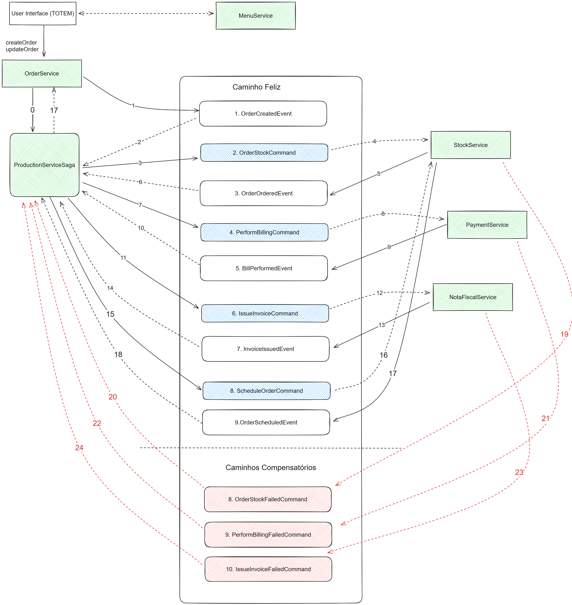

# Bem vindo ao blues burguer

---

<h2>Instruções para rodar a aplicação</h2>

Instalação
- Instalar o make conforme tutorial
- Rodar localmente o comando `make`

Desinstalação
- Rodar localmente o comando `make down`
-----

<h2>SAGA Orquestrada</h2>

----
<h2>Justificativa do padrão SAGA</h2>

O padrão Saga Orquestrada oferece maior flexibilidade na definição de fluxos de trabalho, especialmente nos fluxos iniciais, que tendem a ser mais simples. 
Esse padrão facilita o gerenciamento de transações distribuídas, garantindo consistência e resiliência. Pois, em caso de falha, ações compensatórias podem ser executadas para reverter as mudanças necessárias.
Além disso, o padrão permite a alteração de contextos de forma independente e desacoplada, o que facilita a evolução, manutenção, modificação e gerenciamento de cada contexto, mesmo que por squads diferentes.

----

<h2>Relatórios dos processamentos do OWASP ZAP</h2>

[Link Relatórios OWASP ZAP](https://drive.google.com/drive/folders/1ipo3jmOqAlcxIu7rPoYMlZYY3sXc9ItX?usp=drive_link)

----

<h2>Relatórios RIPD</h2>

[Link Relatório RIPD](https://drive.google.com/file/d/1zmFIYY9QuNIbDRwG-_rAL7rwFmhpcDDq/view?usp=sharing)

<h2>link para video de apresentação</h2>

[Link video apresentação](https://youtu.be/yd4lhvo-uhk)

----
	
<h2>Referências</h2>

- [github aws-doc-sdk-examples](https://github.com/awsdocs/aws-doc-sdk-examples/tree/main/java)
- [ibm-cloud-architecture-saga-orchestration](https://ibm-cloud-architecture.github.io/eda-saga-orchestration/#happy-path)
